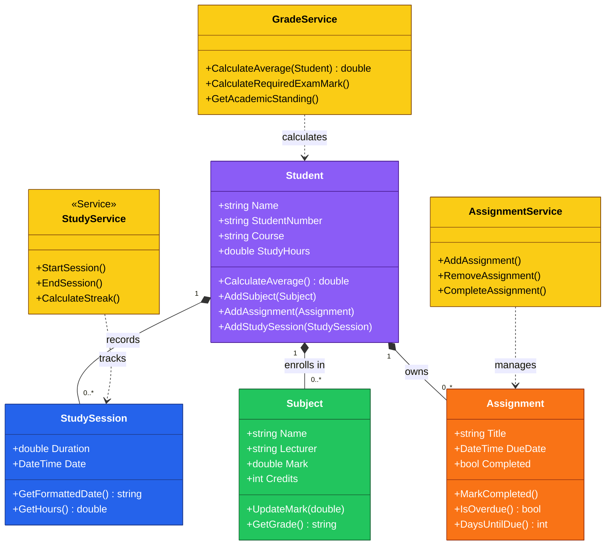

# Build-a-campus-Companion
Campus Companion is a console-based student productivity application that helps university students organize their academic life from one place. Students will build a working application that manages subjects, assignments, grades, and study sessions while learning the core concepts of C# programming.

## Problem Statement

University students use multiple systems to manage their academic
responsibilities. Learning management systems contain coursework,
calendars contain deadlines, calculators estimate grades, and notes are
scattered across different applications.

First-year students especially struggle to keep track of:

-   Assignment deadlines
-   Current marks
-   Study progress
-   Subject performance
-   Daily priorities

The lack of a single, simple planning tool often leads to missed
deadlines and poor time management.

The goal is to develop a lightweight application that demonstrates how
software can solve an everyday student problem while introducing the
fundamental principles of C# programming.

## Project Objectives

Students will learn to:

-   Use variables and data types
-   Capture user input
-   Apply conditional logic
-   Build interactive menus
-   Create reusable methods
-   Work with collections
-   Design classes and objects
-   Organize a multi-file C# project


## Functional Requirements

### Student Profile

The application shall:

-   Store student name.
-   Store student number.
-   Store course name.
-   Display profile information.

### Subject Management

The application shall:

-   Add subjects.
-   Display all subjects.
-   Store lecturer names.
-   Store current marks.

### Assignment Management

The application shall:

-   Add assignments.
-   Display assignments.
-   Mark assignments as completed.
-   Remove completed assignments.

### Grade Calculator

The application shall:

-   Accept current marks.
-   Calculate pass/fail status.
-   Calculate required exam mark.
-   Display average marks.

### Study Tracker

The application shall:

-   Record study sessions.
-   Display total study hours.
-   Display study streak.

### Dashboard

The dashboard shall display:

-   Student name
-   Number of subjects
-   Assignments due
-   Current average
-   Study hours

## Non-Functional Requirements

 | **Requirement**     |  **Description** |
 | ----------------- |------------------------------|
 | Usability         |Easy for beginners  |
  |Performance       |Instant response  |
  |Reliability       |No crashes during normal use  |
  |Maintainability   |Modular code  |
  |Readability       |Clear naming conventions  |
  |Scalability       |Easy to extend  |

  
## User Stories
```
  ID    User Story    
  ------ -------------------------------------------
  US01   As a student I want to create my profile.
  US02   I want to add my subjects.
  US03   I want to track assignments.
  US04   I want to calculate my average.
  US05   I want to monitor study time.
  US06   I want one dashboard showing everything.

```
## Campus Companion UML Class Diagram



## Application Workflow

1.  Launch the application.
2.  View the dashboard.
3.  Choose a menu option.
4.  Perform an action.
5.  Return to the dashboard or exit.
